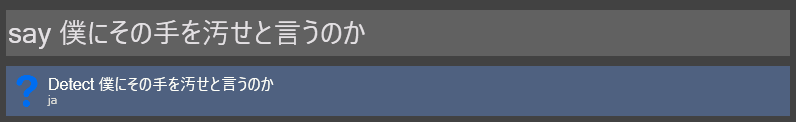
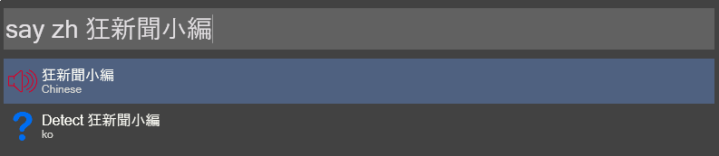

Wox-G-TTS
======
My Text-To-Speech [Wox](http://www.getwox.com/) plugin use `Google Text to Speech`
1. Auto Detect Language

2. Specifie Language

## Prerequisites
---
Depend on 
* [gTTS](https://github.com/pndurette/gTTS)  
* [pygame](https://github.com/pygame/pygame)  
* [langdetect](https://github.com/Mimino666/langdetect)  

## Installing
---
1. Download the [Plugin](https://github.com/sd12582000/wox_g_tts/releases)
2. Edit `config.json`
3. copy the plugin to `<WoxDirectory>\Plugins\<YourPluginDirectory>`
4. restart the Wox
## Configuration
---
Edit the `config.json` file
```
{
    "Common_lang":{
        "zh-cn" : "Chinese (Mandarin/China)",
        "zh-tw" : "Chinese (Mandarin/Taiwan)",
        "ja" : "Japanese",
        "zh" : "Chinese",
        "en" : "English"
    }
}
```
### Attributes
* *Common_lang* : Common Specifiey language option 

## License
This plugin is licensed under the MIT License 